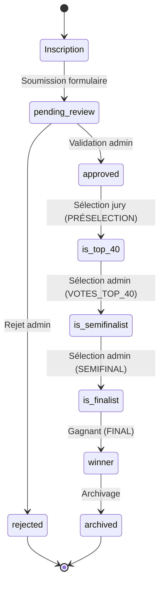

# Documentation Fonctionnelle - Top Talent Benin

## Table des matières
1. [Vue d'ensemble du système](#vue-densemble-du-système)
2. [Parcours utilisateurs](#parcours-utilisateurs)
3. [Règles de gestion métier](#règles-de-gestion-métier)
4. [Phases de la compétition](#phases-de-la-compétition)
5. [Workflow des candidatures](#workflow-des-candidatures)

---

## Vue d'ensemble du système

Top Talent Benin est une plateforme de compétition artistique en ligne qui permet :
- Aux candidats de déposer leurs performances vidéo
- Au jury d'évaluer les talents selon des critères techniques
- Au public de voter pour leurs favoris via Mobile Money
- À l'administration de piloter l'ensemble du processus

### Acteurs principaux
- **Candidat** : Artiste qui soumet sa candidature
- **Jury** : Expert qui évalue les performances
- **Admin** : Administrateur qui gère la plateforme
- **Public** : Visiteurs qui votent pour les candidats

---

## Parcours utilisateurs

### 1. Parcours Candidat

#### Inscription
1. **Accès** : Via la page `/candidature` (uniquement en phase PRÉSELECTION)
2. **Formulaire en 3 étapes** :
   - **Étape 1** : Identité artistique
     - Nom de scène (vérification unicité en temps réel)
     - Discipline artistique (8 catégories)
     - Bio (max 250 caractères)
   - **Étape 2** : Coordonnées
     - Département (12 départements du Bénin)
     - Email (vérification unicité)
     - Téléphone (8 chiffres)
     - Mot de passe (critères de sécurité)
   - **Étape 3** : Médias
     - Vidéo de performance (max 50 Mo, MP4/MOV)
     - Image de couverture (max 5 Mo, avec recadrage)
3. **Auto-save** : Brouillon sauvegardé automatiquement dans localStorage
4. **Soumission** : Création compte Supabase Auth + upload vidéos + création profil

#### Connexion
- Via `/candidature?view=login`
- Redirection automatique vers `/dashboard/candidate`
- Gestion des erreurs de connexion traduites en français

#### Dashboard Candidat
- Affichage du statut de candidature
- Visualisation des votes reçus
- Accès aux informations personnelles

### 2. Parcours Jury

#### Connexion
- Via `/dashboard/jury` (protégé par middleware)
- Redirection selon le rôle depuis auth

#### Dashboard Jury
- **4 onglets** :
  - **Sélection** : Phase PRÉSELECTION - validation des candidats
  - **Évaluation** : Notation sur 3 critères (Technique, Originalité, Présence)
  - **Historique** : Consultation des notes passées
  - **Statistiques** : Vue d'ensemble des évaluations

#### Processus de notation
1. **Filtrage par phase** : Seuls les candidats de la phase actuelle sont visibles
2. **Critères d'évaluation** (sur 20 points chacun) :
   - Technique : Compétence technique
   - Originalité : Créativité et innovation
   - Présence : Charisme et mise en scène
3. **Validation** : Confirmation obligatoire avant enregistrement
4. **Modification** : Possibilité de modifier les notes jusqu'à validation

### 3. Parcours Admin

#### Connexion
- Via `/dashboard/admin` (protégé par middleware)
- Accès complet à toutes les fonctionnalités

#### Dashboard Admin
- **5 onglets principaux** :
  1. **Jury** : Gestion des membres du jury (CRUD)
  2. **Modération** : Validation des candidatures
  3. **Phases** : Pilotage des phases de compétition
  4. **Settings** : Configuration globale
  5. **Preview** : Aperçu du site public

#### Fonctionnalités clés
- **Gestion Jury** : Création, modification, suppression des jurés
- **Modération** : Approuver/Rejeter les candidatures
- **Pilotage de phase** : Changer la phase actuelle
- **Mode maintenance** : Activer/désactiver le site
- **Gestion des votes** : Surveillance des transactions

---

## Règles de gestion métier

### Règles de candidature

#### Unicité
- **Nom de scène** : Unique parmi tous les candidats
- **Email** : Unique dans le système (auth.users)
- **Vérification en temps réel** : Feedback immédiat lors de la saisie

#### Validation des médias
- **Vidéo** :
  - Format : MP4, MOV
  - Taille max : 50 Mo
  - Durée suggérée : 1 minute
- **Image de couverture** :
  - Format : JPG, PNG
  - Taille max : 5 Mo
  - Recadrage obligatoire via cropper

#### Mot de passe
- Minimum 8 caractères
- Au moins 1 majuscule
- Au moins 1 chiffre
- Au moins 1 caractère spécial

#### Types de candidature
- **Solo** : 1 membre
- **Groupe** : 2+ membres (avec nombre de membres spécifié)

### Règles de vote

#### Tarification
- **1 vote** : 500 FCFA
- **3 votes** : 1 000 FCFA (pack économique)
- **10 votes** : 3 000 FCFA (pack premium)

#### Opérateurs Mobile Money
- MTN MoMo
- Moov Money

#### Contraintes
- Numéro de téléphone : 8 chiffres (format béninois)
- Phase de vote : Uniquement quand `is_voting_open = true`
- Transaction unique par référence

#### Workflow de paiement
1. Initialisation via API FedaPay
2. USSD Push vers le téléphone
3. Validation PIN par l'utilisateur
4. Webhook de confirmation
5. Enregistrement du vote

### Règles de notation du jury

#### Critères
- **Technique** (0-20) : Compétence technique
- **Originalité** (0-20) : Créativité et innovation
- **Présence** (0-20) : Charisme et mise en scène

#### Calcul de la moyenne
```
Moyenne = (Technique + Originalité + Présence) / 3
```

#### Contraintes
- Un juré ne peut noter qu'une fois par candidat par phase
- Notes modifiables jusqu'à confirmation
- Phase de notation liée à la phase système actuelle

### Règles de calcul du score hybride

#### Formule
```
Score Final = 0.5 × (Moyenne Jury) + 0.5 × (Votes Public Normalisés)
```

#### Normalisation des votes publics
```
Votes Normalisés = (Votes Candidat / Max Votes) × 20
```

#### Tie-breaker
- En cas d'égalité, l'admin peut forcer un candidat gagnant via `forced_tie_breaker_candidate_id`

---

## Phases de la compétition

### 1. PRÉSELECTION
- **Durée** : Période d'inscription des candidats
- **Accès candidature** : Ouvert
- **Rôle jury** : Sélection des Top 40
- **Rôle public** : Pas de vote
- **Actions admin** :
  - Modération des candidatures
  - Validation des candidats
  - Sélection des Top 40 (is_top_40)

### 2. VOTES_TOP_40 (Audition)
- **Durée** : Vote public pour les Top 40
- **Accès candidature** : Fermé
- **Rôle jury** : Notation des Top 40
- **Rôle public** : Vote ouvert (Mobile Money)
- **Actions admin** :
  - Surveillance des votes
  - Sélection des Top 20 (is_semifinalist)

### 3. SEMIFINAL
- **Durée** : Demi-finale avec Top 20
- **Accès candidature** : Fermé
- **Rôle jury** : Notation des Top 20
- **Rôle public** : Vote ouvert
- **Actions admin** :
  - Sélection des Finalistes (is_finalist)

### 4. FINAL
- **Durée** : Grande finale
- **Accès candidature** : Fermé
- **Rôle jury** : Notation finale
- **Rôle public** : Vote final
- **Actions admin** :
  - Détermination du gagnant
  - Archivage de la compétition

### 5. ARCHIVED
- **Durée** : Après la compétition
- **Accès** : Lecture seule
- **Actions** : Conservation des données

---

## Workflow des candidatures

### Cycle de vie d'une candidature



### Statuts des candidats

| Statut | Description | Qui peut modifier |
|--------|-------------|-------------------|
| `pending_review` | En attente de validation | Admin |
| `approved` | Validé et visible | Admin |
| `rejected` | Rejeté | Admin |
| `is_top_40` | Sélectionné Top 40 | Admin/Jury |
| `is_semifinalist` | Sélectionné Top 20 | Admin |
| `is_finalist` | Finaliste | Admin |
| `winner` | Gagnant | Admin |

### Contraintes RLS (Row Level Security)

#### Table candidates
- **Lecture publique** : Candidats approuvés uniquement
- **Lecture candidat** : Ses propres candidatures
- **CRUD admin** : Accès complet aux admins
- **Insertion** : Uniquement par le propriétaire du profil

#### Table jury_ratings
- **Lecture** : Jury et admin uniquement
- **Insert/Update** : Jury uniquement
- **Unicité** : (jury_id, candidate_id, phase)

#### Table votes
- **Lecture publique** : Votes réussis uniquement
- **Insertion** : Service role uniquement (via webhook)
- **Modification** : Service role uniquement

#### Table system_control
- **Lecture publique** : Tous les utilisateurs
- **Modification** : Admin uniquement

---

## Disciplines artistiques

8 catégories acceptées :
1. **Musique** : Chant, Rap, Afrobeat, Gospel, Traditionnel
2. **Danse** : Danses urbaines, Traditionnelles, Afro, Breakdance
3. **Humour** : Stand-up, Blagues, Imitation, Éwé, Théâtre
4. **Art Oratoire** : Slam, Poésie, Éloquence, Parole, Conte
5. **Digital** : TikTok, Vidéastes, Créateurs de contenu, Beatmaking
6. **Cirque** : Magie, Jonglage, Cracheurs de feu, Gymnastique
7. **Sport** : Foot freestyle, Roller, Sports acrobatiques, Skate
8. **Arts Visuels** : Dessin, Peinture, Mode, Stylisme, Maquillage

---

## Départements du Bénin

12 départements couverts :
1. Alibori (Kandi)
2. Atacora (Natitingou)
3. Atlantique (Calavi)
4. Borgou (Parakou)
5. Collines (Dassa)
6. Donga (Djougou)
7. Kouffo (Aplahoué)
8. Littoral (Cotonou)
9. Mono (Lokossa)
10. Ouémé (Porto-Novo)
11. Plateau (Pobè)
12. Zou (Abomey)

---

## Sécurité et authentification

### Rôles utilisateurs
- **visitor** : Visiteur non connecté
- **candidate** : Candidat inscrit
- **jury** : Membre du jury
- **admin** : Administrateur système

### Middleware d'authentification
- Vérification de la session Supabase
- Redirection selon le rôle
- Protection des dashboards

### Gestion des sessions
- Cookies sécurisés (SameSite=Lax, Secure)
- Token Supabase (access + refresh)
- Clear complet à la déconnexion
