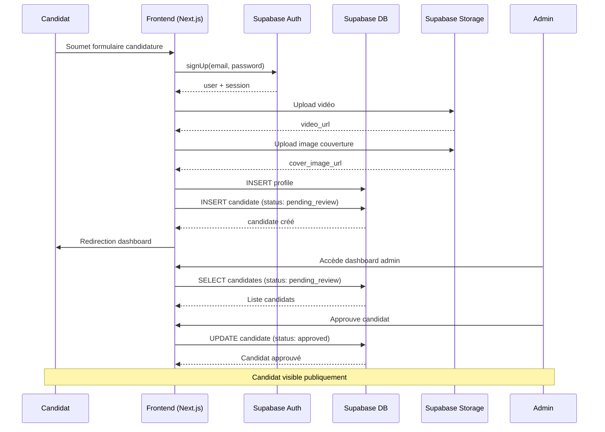
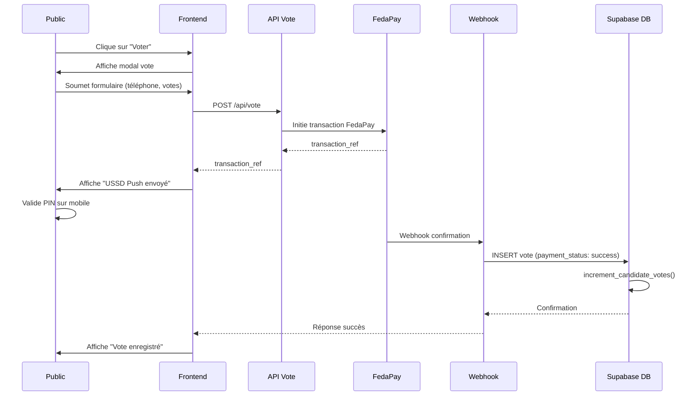
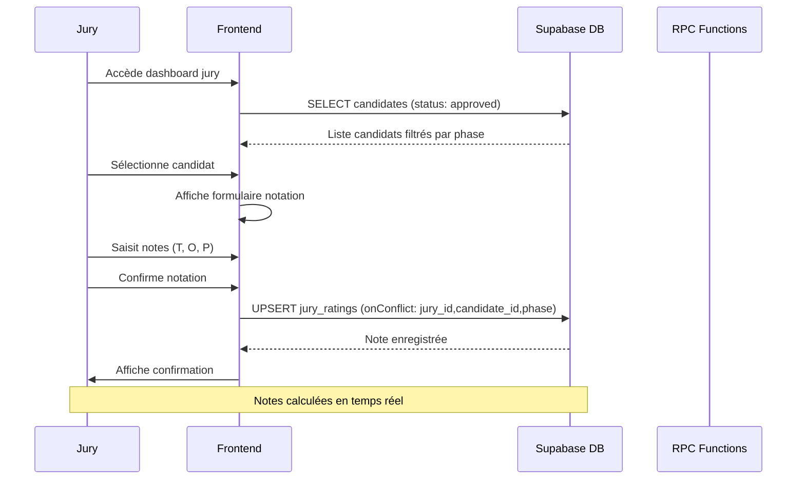
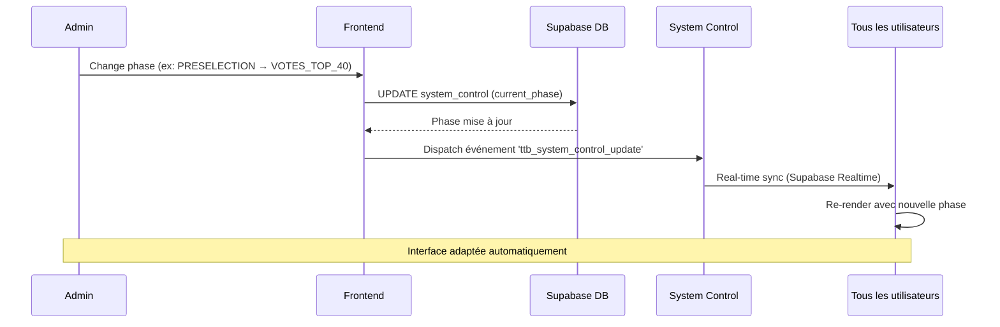

# Documentation Technique - Top Talent Benin

## Table des matières
1. [Architecture technique](#architecture-technique)
2. [Workflow de données](#workflow-de-données)
3. [Interactions avec Supabase](#interactions-avec-supabase)
4. [Gestion des sessions et cookies](#gestion-des-sessions-et-cookies)
5. [Fonctions RPC et Triggers](#fonctions-rpc-et-triggers)
6. [Structure du projet](#structure-du-projet)

---

## Architecture technique

### Stack technologique

#### Frontend
- **Framework** : Next.js 15 (App Router)
- **Language** : TypeScript
- **Styling** : TailwindCSS
- **UI Components** : Custom components + Lucide icons
- **Animations** : Framer Motion
- **Forms** : React Hook Form + react-dom
- **Image Cropping** : react-easy-crop

#### Backend
- **BaaS** : Supabase (PostgreSQL + Auth + Storage)
- **API Routes** : Next.js API routes
- **Server Actions** : Next.js Server Actions
- **Webhooks** : FedaPay payment webhooks

#### Infrastructure
- **Hosting** : Vercel (recommandé)
- **Database** : Supabase PostgreSQL
- **Storage** : Supabase Storage (candidate-videos bucket)
- **CDN** : Supabase CDN pour les médias

### Architecture du projet

```
top-talent-benin/
├── app/
│   ├── actions/          # Server Actions
│   ├── admin/            # Pages admin
│   ├── api/              # API Routes
│   ├── dashboard/        # Dashboards (candidate, jury, admin)
│   └── candidature/      # Page d'inscription
├── components/
│   ├── home/             # Composants page d'accueil
│   └── ui/               # Composants UI réutilisables
├── lib/
│   ├── constants/        # Constantes métier
│   ├── scoring/          # Algorithmes de scoring
│   └── supabase/         # Client Supabase + types + db
├── public/               # Assets statiques
├── supabase/             # Scripts SQL
└── docs/                 # Documentation
```

---

## Workflow de données

### Cycle de vie d'une candidature



### Workflow de vote



### Workflow de notation jury



### Workflow de changement de phase



---

## Interactions avec Supabase

### Client Supabase

#### Configuration
```typescript
// lib/supabase/client.ts
import { createBrowserClient } from '@supabase/ssr'

export const supabase = createBrowserClient(
  process.env.NEXT_PUBLIC_SUPABASE_URL!,
  process.env.NEXT_PUBLIC_SUPABASE_ANON_KEY!
)
```

#### Server Client
```typescript
// lib/supabase/server.ts
import { createServerClient } from '@supabase/ssr'
import { cookies } from 'next/headers'

export const createClient = async () => {
  const cookieStore = await cookies()
  return createServerClient(
    process.env.NEXT_PUBLIC_SUPABASE_URL!,
    process.env.NEXT_PUBLIC_SUPABASE_ANON_KEY!,
    { cookies: { get, set, remove } }
  )
}
```

### Database Layer (lib/supabase/db.ts)

#### Pattern de fallback
```typescript
export const db = {
  getCandidates: async (options?) => {
    if (supabase) {
      // Try Supabase first
      const { data, error } = await supabase.from('candidates').select('*')
      if (!error && data) return data
    }
    // Fallback to localStorage for development
    initLocalStorage()
    return JSON.parse(localStorage.getItem('ttb_candidates') || '[]')
  }
}
```

#### Fonctions principales

| Fonction | Description | RLS Policy |
|----------|-------------|------------|
| `getSystemControl()` | Récupère la phase actuelle | Lecture publique |
| `updateSystemControl()` | Met à jour la phase | Admin uniquement |
| `getCandidates()` | Liste des candidats | Filtrée par status |
| `createCandidate()` | Crée un candidat | Propriétaire uniquement |
| `updateCandidateStatus()` | Change le statut | RPC bypass RLS |
| `confirmCandidateByAdmin()` | Confirme candidat | RPC bypass RLS |
| `saveJuryRating()` | Enregistre note jury | Jury uniquement |
| `getJuryAverages()` | Calcule moyennes jury | Lecture publique |
| `addVote()` | Ajoute un vote | Service role uniquement |

### Storage

#### Bucket configuration
```sql
CREATE STORAGE BUCKET candidate-videos
WITH (PUBLIC = true);
```

#### Policies
- **Lecture publique** : Tous les utilisateurs
- **Upload** : Authentifié + propriétaire du dossier
- **Delete** : Authentifié + propriétaire du dossier

#### Upload pattern
```typescript
const fileName = `${userId}/${Date.now()}.${fileExt}`
const { data, error } = await supabase.storage
  .from('candidate-videos')
  .upload(fileName, file)
```

---

## Gestion des sessions et cookies

### Authentification Supabase

#### Sign Up (Candidat)
```typescript
const { data, error } = await supabase.auth.signUp({
  email,
  password,
  options: {
    data: { role: 'candidate' }
  }
})
```

#### Sign In
```typescript
const { data, error } = await supabase.auth.signInWithPassword({
  email,
  password
})
```

#### Sign Out
```typescript
await supabase.auth.signOut()
// Clear localStorage
localStorage.removeItem('user_id')
localStorage.removeItem('user_role')
// Clear cookies
document.cookie = 'sb-access-token=; path=/; expires=...'
```

### Middleware d'authentification

```typescript
// middleware.ts
export async function middleware(request: NextRequest) {
  const supabase = createServerClient(/* ... */)
  const { data: { session } } = await supabase.auth.getSession()
  
  // Protected routes
  if (request.nextUrl.pathname.startsWith('/dashboard')) {
    if (!session) {
      return NextResponse.redirect(new URL('/candidature?view=login', request.url))
    }
    
    // Role-based routing
    const { data: profile } = await supabase
      .from('profiles')
      .select('role')
      .eq('id', session.user.id)
      .single()
    
    if (profile?.role === 'candidate' && !request.nextUrl.pathname.includes('/candidate')) {
      return NextResponse.redirect(new URL('/dashboard/candidate', request.url))
    }
    // ... other role checks
  }
  
  return NextResponse.next()
}
```

### Cookie management

#### Server-side cookies
```typescript
const cookieStore = await cookies()
const supabase = createServerClient(
  url,
  key,
  {
    cookies: {
      get(name) { return cookieStore.get(name)?.value },
      set(name, value, options) { cookieStore.set({ name, value, ...options }) },
      remove(name, options) { cookieStore.delete({ name, ...options }) }
    }
  }
)
```

#### Client-side cookies
```typescript
// Auto-managed by Supabase client
// Custom cookies for additional data
document.cookie = `user_role=${role}; path=/; SameSite=Lax; Secure`
```

### Session persistence

#### Auto-refresh
```typescript
useEffect(() => {
  const { data: { subscription } } = supabase.auth.onAuthStateChange(
    (event, session) => {
      if (event === 'SIGNED_IN') {
        // Update app state
      } else if (event === 'SIGNED_OUT') {
        // Clear app state
      }
    }
  )
  return () => subscription.unsubscribe()
}, [])
```

---

## Fonctions RPC et Triggers

### RPC Functions (PostgreSQL)

#### 1. update_candidate_status
```sql
CREATE OR REPLACE FUNCTION public.update_candidate_status(
  candidate_uuid UUID,
  new_status TEXT
)
RETURNS JSON AS $$
DECLARE
  user_id UUID;
  user_role TEXT;
BEGIN
  user_id := auth.uid();
  SELECT role INTO user_role FROM public.profiles WHERE id = user_id;
  
  IF user_role != 'admin' THEN
    RETURN json_build_object('success', false, 'error', 'User is not admin');
  END IF;
  
  UPDATE public.candidates
  SET status = new_status
  WHERE id = candidate_uuid;
  
  RETURN json_build_object('success', true, 'candidate_id', candidate_uuid);
END;
$$ LANGUAGE plpgsql SECURITY DEFINER;
```

**Usage** : Bypass RLS pour les mises à jour admin

#### 2. confirm_candidate_by_admin
```sql
CREATE OR REPLACE FUNCTION public.confirm_candidate_by_admin(
  candidate_uuid UUID,
  is_confirmed BOOLEAN
)
RETURNS JSON AS $$
-- Similar structure to update_candidate_status
-- Updates is_confirmed_by_admin field
$$ LANGUAGE plpgsql SECURITY DEFINER;
```

#### 3. increment_candidate_votes
```sql
CREATE OR REPLACE FUNCTION public.increment_candidate_votes(
  candidate_uuid UUID,
  vote_increment INT
)
RETURNS VOID AS $$
BEGIN
  UPDATE public.candidates
  SET votes_count = votes_count + vote_increment
  WHERE id = candidate_uuid;
END;
$$ LANGUAGE plpgsql SECURITY DEFINER;
```

**Usage** : Appelé par le webhook de paiement

#### 4. get_candidate_vote_counts
```sql
CREATE OR REPLACE FUNCTION public.get_candidate_vote_counts()
RETURNS TABLE (
  candidate_id UUID,
  total_votes INT,
  total_amount NUMERIC
) AS $$
BEGIN
  RETURN QUERY
  SELECT
    v.candidate_id,
    COALESCE(SUM(v.vote_count), 0) as total_votes,
    COALESCE(SUM(v.amount_fcfa), 0) as total_amount
  FROM public.votes v
  WHERE v.payment_status = 'success'
  GROUP BY v.candidate_id;
END;
$$ LANGUAGE plpgsql SECURITY DEFINER;
```

**Usage** : Agrégation optimisée pour le dashboard

### Triggers

#### handle_profile_role_update
```sql
CREATE OR REPLACE FUNCTION public.handle_profile_role_update()
RETURNS TRIGGER AS $$
BEGIN
  UPDATE auth.users
  SET raw_app_meta_data = jsonb_set(
    COALESCE(raw_app_meta_data, '{}'::jsonb),
    '{role}',
    to_jsonb(NEW.role)
  )
  WHERE id = NEW.id;
  RETURN NEW;
END;
$$ LANGUAGE plpgsql SECURITY DEFINER;

CREATE TRIGGER on_profile_role_change
AFTER INSERT OR UPDATE OF role ON public.profiles
FOR EACH ROW
EXECUTE FUNCTION public.handle_profile_role_update();
```

**Usage** : Synchronise le rôle dans auth.users.app_metadata

### Vues

#### candidate_jury_averages
```sql
CREATE OR REPLACE VIEW public.candidate_jury_averages AS
SELECT 
    candidate_id,
    phase,
    COUNT(jury_id) as jury_count,
    ROUND(AVG(score_technique), 2) as avg_technique,
    ROUND(AVG(score_originalite), 2) as avg_originalite,
    ROUND(AVG(score_presence), 2) as avg_presence,
    ROUND(AVG((score_technique + score_originalite + score_presence) / 3.0), 2) as total_jury_average
FROM public.jury_ratings
GROUP BY candidate_id, phase;
```

**Usage** : Calcul automatique des moyennes jury

---

## Structure du projet

### Types TypeScript

#### lib/supabase/types.ts
```typescript
export interface Profile {
  id: string;
  email?: string;
  full_name: string;
  phone: string;
  role: 'visitor' | 'candidate' | 'jury' | 'admin';
  avatar_url?: string;
  created_at: string;
}

export interface Candidate {
  id: string;
  profile_id: string;
  stage_name: string;
  discipline: Discipline;
  region: Region;
  video_url: string;
  cover_image_url?: string;
  status: 'pending_review' | 'approved' | 'rejected';
  is_confirmed_by_admin?: boolean;
  is_top_40?: boolean;
  is_semifinalist?: boolean;
  is_finalist?: boolean;
  created_at: string;
}

export interface Vote {
  id: string;
  candidate_id: string;
  vote_count: number;
  amount_fcfa: number;
  phone_payer: string;
  network: 'MTN' | 'MOOV';
  transaction_ref: string;
  payment_status: 'pending' | 'success' | 'failed';
  phase: 'preselection' | 'audition' | 'semifinal' | 'final';
  created_at: string;
}

export interface JuryRating {
  id: string;
  jury_id: string;
  candidate_id: string;
  score_technique: number;
  score_originalite: number;
  score_presence: number;
  is_approved_preselection: boolean;
  phase: 'preselection' | 'audition' | 'semifinal' | 'final';
  created_at: string;
}

export interface SystemControl {
  id: number;
  current_phase: 'PRESELECTION' | 'VOTES_TOP_40' | 'SEMIFINAL' | 'FINAL' | 'ARCHIVED';
  live_voting_candidate_id: string | null;
  is_voting_open: boolean;
  forced_tie_breaker_candidate_id: string | null;
  is_maintenance_mode?: boolean;
  created_at: string;
  updated_at: string;
}
```

### Algorithmes de scoring

#### lib/scoring/hybrid-score.ts
```typescript
export function calculateHybridScore(
  candidateId: string,
  votes: Vote[],
  juryAverages: Record<string, JuryAverage>,
  candidates: Candidate[]
) {
  const maxVotes = Math.max(1, ...candidates.map(c => getCandidateVotes(votes, c.id)))
  const avgJury = juryAverages[candidateId]?.total_jury_average ?? 10
  const normalizedPublic = (getCandidateVotes(votes, candidateId) / maxVotes) * 20
  const finalScore = 0.5 * avgJury + 0.5 * normalizedPublic
  return Math.round(finalScore * 100) / 100
}

export function rankCandidatesByHybridScore(
  candidates: Candidate[],
  votes: Vote[],
  juryAverages: Record<string, JuryAverage>,
  systemControl: SystemControl | null
) {
  return [...candidates].sort((a, b) => {
    const scoreA = calculateHybridScore(a.id, votes, juryAverages, candidates)
    const scoreB = calculateHybridScore(b.id, votes, juryAverages, candidates)
    
    if (scoreA === scoreB) {
      if (systemControl?.forced_tie_breaker_candidate_id === a.id) return -1
      if (systemControl?.forced_tie_breaker_candidate_id === b.id) return 1
    }
    
    return scoreB - scoreA
  })
}
```

### API Routes

#### /api/vote (POST)
```typescript
export async function POST(request: Request) {
  const { candidate_id, vote_count, phone_payer, network, phase } = await request.json()
  
  // Initiate FedaPay transaction
  const fedaPayResponse = await initiateTransaction({
    amount: calculateAmount(vote_count),
    phone: phone_payer,
    network
  })
  
  return Response.json({
    success: true,
    transaction_ref: fedaPayResponse.transaction_ref
  })
}
```

#### /api/admin/create-user (POST)
```typescript
export async function POST(request: Request) {
  const { email, password, fullName, phone, avatarUrl } = await request.json()
  
  // Create auth user
  const { data: authData } = await supabase.auth.admin.createUser({
    email,
    password,
    email_confirm: true
  })
  
  // Create profile
  const { data: profile } = await supabase.from('profiles').insert({
    id: authData.user.id,
    full_name: fullName,
    phone,
    role: 'jury'
  })
  
  return Response.json({ user: authData.user, profile })
}
```

### Server Actions

#### app/actions/auth.ts
```typescript
'use server'

export async function signIn(state: { error: string } | null, formData: FormData) {
  const email = formData.get('email') as string
  const password = formData.get('password') as string
  
  const supabase = createServerClient(/* ... */)
  const { data, error } = await supabase.auth.signInWithPassword({ email, password })
  
  if (error) {
    // Translate error messages to French
    return { error: translateError(error.message) }
  }
  
  // Get user role and redirect
  const { data: profile } = await supabase.from('profiles').select('role').eq('id', data.session.user.id).single()
  
  if (profile.role === 'candidate') redirect('/dashboard/candidate')
  else if (profile.role === 'admin') redirect('/dashboard/admin')
  else if (profile.role === 'jury') redirect('/dashboard/jury')
}
```

#### app/actions/admin.ts
```typescript
'use server'

export async function updateCandidateStatus(candidateId: string, status: Candidate['status']) {
  const supabase = createServerClient(/* ... */)
  
  const { data, error } = await supabase
    .from('candidates')
    .update({ status })
    .eq('id', candidateId)
    .select()
    .single()
  
  return data
}
```

---

## Real-time synchronization

### Supabase Realtime

#### Subscription to system_control changes
```typescript
useEffect(() => {
  const channel = supabase
    .channel('system_control_changes')
    .on(
      'postgres_changes',
      {
        event: 'UPDATE',
        schema: 'public',
        table: 'system_control'
      },
      (payload) => {
        setSystemControl(payload.new as SystemControl)
      }
    )
    .subscribe()
  
  return () => channel.unsubscribe()
}, [])
```

#### Custom events (localStorage fallback)
```typescript
// Dispatch event
window.dispatchEvent(new CustomEvent('ttb_system_control_update', { detail: updated }))

// Listen to event
useEffect(() => {
  const handler = (e: CustomEvent) => {
    setSystemControl(e.detail)
  }
  window.addEventListener('ttb_system_control_update', handler)
  return () => window.removeEventListener('ttb_system_control_update', handler)
}, [])
```

---

## Performance optimization

### Database indexes
```sql
-- Candidates
CREATE INDEX idx_candidates_status ON candidates(status);
CREATE INDEX idx_candidates_stage_name ON candidates(stage_name);
CREATE INDEX idx_candidates_profile_id ON candidates(profile_id);

-- Votes
CREATE INDEX idx_votes_candidate_id ON votes(candidate_id);
CREATE INDEX idx_votes_payment_status ON votes(payment_status);
CREATE INDEX idx_votes_phase ON votes(phase);

-- Jury ratings
CREATE INDEX idx_jury_ratings_candidate_id ON jury_ratings(candidate_id);
CREATE INDEX idx_jury_ratings_jury_id ON jury_ratings(jury_id);
CREATE INDEX idx_jury_ratings_phase ON jury_ratings(phase);
```

### Caching strategy
- **System control** : Cached in localStorage + real-time sync
- **Candidates** : Fetched on demand, filtered by phase
- **Jury ratings** : Cached per phase
- **Vote counts** : RPC function for aggregation

### Image optimization
- Cover images cropped to 16:9 ratio
- Video thumbnails generated on upload
- Lazy loading for media components

---

## Error handling

### Global error boundary
```typescript
// app/error.tsx
'use client'

export default function Error({
  error,
  reset,
}: {
  error: Error & { digest?: string }
  reset: () => void
}) {
  return (
    <div>
      <h2>Une erreur est survenue</h2>
      <button onClick={() => reset()}>Réessayer</button>
    </div>
  )
}
```

### Supabase error translation
```typescript
const translateError = (message: string): string => {
  const lower = message.toLowerCase()
  
  if (lower.includes('invalid credentials')) 
    return 'Adresse email ou mot de passe incorrect'
  if (lower.includes('email not confirmed'))
    return 'Veuillez confirmer votre adresse email'
  if (lower.includes('user not found'))
    return 'Compte introuvable'
    
  return 'Erreur de connexion. Veuillez réessayer.'
}
```

---

## Security considerations

### RLS Policies
- **Principle of least privilege** : Each role has minimal required access
- **Service role** : Used only for webhook operations
- **RPC functions** : SECURITY DEFINER for admin operations

### Input validation
- **Client-side** : React Hook Form validation
- **Server-side** : Zod schema validation in API routes
- **Database** : CHECK constraints on columns

### File upload security
- **Size limits** : 50MB for videos, 5MB for images
- **Type validation** : MIME type checking
- **User isolation** : Files stored in user-specific folders

### Payment security
- **Transaction references** : Unique per transaction
- **Webhook signature** : Verify FedaPay signatures
- **Idempotency** : Prevent duplicate vote recording

---

## Monitoring and logging

### Client-side logging
```typescript
console.log('[DB] Candidates query success:', { resultsCount, status })
console.error('[DB] Error fetching candidates:', error)
```

### Server-side logging
```typescript
console.log('[Server Action] updateCandidateStatus - Attempting to update candidate:', candidateId)
console.error('[Server Action] updateCandidateStatus - Error:', error)
```

### Error tracking
- Supabase dashboard for database errors
- Vercel logs for API errors
- Custom error boundaries for frontend errors

---

## Deployment

### Environment variables
```env
NEXT_PUBLIC_SUPABASE_URL=your-project-url
NEXT_PUBLIC_SUPABASE_ANON_KEY=your-anon-key
SUPABASE_SERVICE_ROLE_KEY=your-service-role-key
FEDAPAY_API_KEY=your-fedapay-key
FEDAPAY_SECRET_KEY=your-fedapay-secret
```

### Build process
```bash
npm run build
npm run start
```

### Database migrations
```bash
# Apply schema
supabase db push

# Seed data
supabase db seed
```
